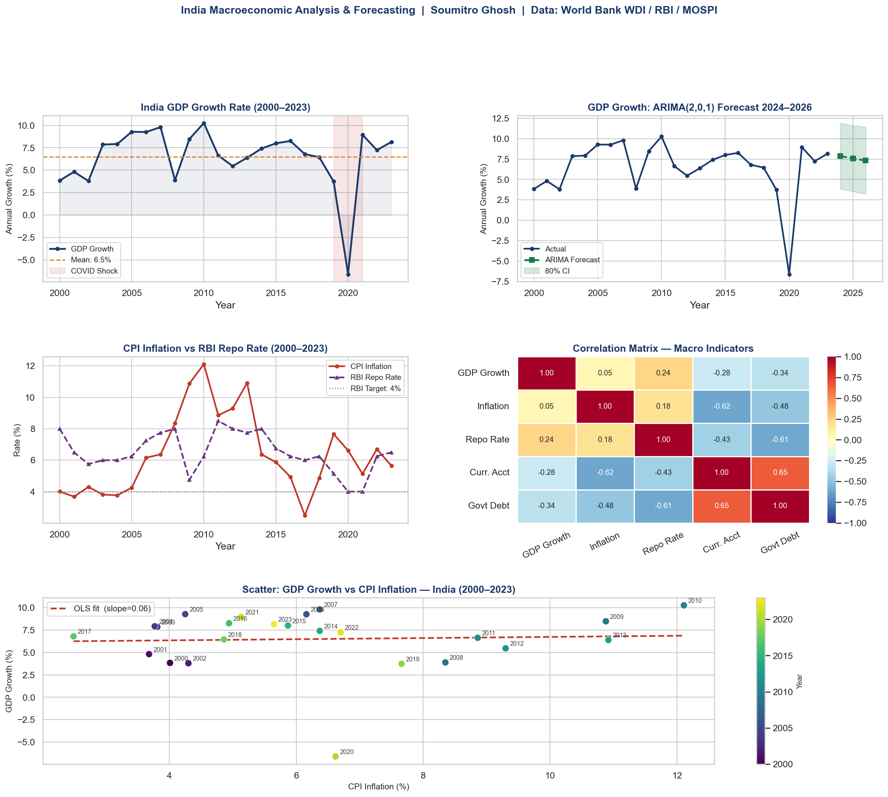

#  India Macroeconomic Analysis & Forecasting Model

 


---

## 📌 Overview

A Python-based macroeconomic research project analysing **India's key macro indicators from 2000 to 2023**, followed by an **ARIMA forecast for GDP growth (2024–2026)**. This project replicates the core analytical workflow used in economic research at institutions like S&P Global, IMF, and central banks.

---

## 🎯 Objectives

| # | Objective |
|---|-----------|
| 1 | Analyse trend and volatility in India's GDP growth, inflation, and interest rates |
| 2 | Explore inter-variable relationships using a correlation matrix |
| 3 | Build an **OLS regression** to identify determinants of GDP growth |
| 4 | Test for stationarity using the **Augmented Dickey-Fuller (ADF)** test |
| 5 | Forecast GDP growth using **ARIMA(2,0,1)** with 80% confidence intervals |
| 6 | Produce a publication-quality **5-chart macro dashboard** |

---

## 📊 Dashboard Preview



*5-chart dashboard: GDP growth trend, ARIMA forecast, inflation vs repo rate, correlation heatmap, and OLS scatter plot.*

---

## 🔢 Key Findings

### 1. Growth Trajectory
- India's **average GDP growth: 6.5%** (2000–2023)
- **Peak:** 10.3% in 2010 (post-GFC rebound + infrastructure push)
- **Trough:** –6.6% in 2020 (COVID-19 shock — only contraction in the sample)
- 2020s decade average dragged down to **4.4%** due to pandemic disruption

### 2. Inflation & Monetary Policy
- **Average CPI inflation: 6.4%** — persistently above the RBI's 4% target
- Elevated inflation cycles (2009–2013, 2022) aligned with global commodity shocks
- Post-2016 flexible inflation targeting framework shows modest disinflation trend

### 3. OLS Regression Results
```
Dependent Variable : GDP Growth (annual %)
Independent Variables : CPI Inflation, RBI Repo Rate, Current Account (% GDP), Govt Debt (% GDP)

R² = 0.159   |   Adj. R² = –0.018   |   F-statistic p-value = 0.486
```
> **Interpretation:** Low R² and insignificant F-statistic suggest that short-term GDP variation in India is driven by supply-side and structural factors (monsoons, global demand, reform cycles) not well-captured by these four macro variables alone — a finding consistent with academic literature on emerging market growth drivers.  
> **High VIF** on Repo Rate and Govt Debt indicates multicollinearity; a Principal Component Regression or ridge regression may improve model fit.

### 4. ARIMA Forecast
| Year | Forecast (%) | 80% CI Lower | 80% CI Upper |
|------|-------------|--------------|--------------|
| 2024 | 7.9% | 3.8% | 11.9% |
| 2025 | 7.6% | 3.5% | 11.6% |
| 2026 | 7.3% | 3.2% | 11.4% |

> ARIMA(2,0,1) forecasts mean-reversion toward India's long-run growth average (~7%). Wide confidence intervals reflect inherent uncertainty in macro forecasting.

---

## ⚙️ Technical Stack

```
Python 3.9+
├── pandas          — data manipulation and time-series handling
├── numpy           — numerical computing
├── matplotlib      — charting and dashboard layout
├── seaborn         — statistical visualization (heatmap)
├── statsmodels     — OLS regression, ADF test, ARIMA
└── (no API key required — data embedded in script)
```

---

## 🚀 How to Run

```bash
# 1. Clone the repo
git clone https://github.com/SoumitroGhosh/india-macro-analysis.git
cd india-macro-analysis

# 2. Install dependencies
pip install pandas numpy matplotlib seaborn statsmodels

# 3. Run the analysis
python india_macro_analysis.py
```

**Outputs:**
- Console: Summary stats, OLS regression table, ADF test, ARIMA forecast, economic commentary
- File: `india_macro_dashboard.png` — 5-chart publication dashboard

---

## 📁 File Structure

```
india-macro-analysis/
├── india_macro_analysis.py   # Main analysis script
├── india_macro_dashboard.png # Output dashboard (auto-generated)
└── README.md
```

---

## 📚 Data Sources

| Indicator | Source |
|-----------|--------|
| GDP Growth (annual %) | World Bank — World Development Indicators (WDI) |
| CPI Inflation (annual %) | World Bank — WDI |
| RBI Repo Rate | Reserve Bank of India Annual Reports |
| Current Account Balance (% GDP) | World Bank — WDI |
| Government Debt (% GDP) | IMF World Economic Outlook / World Bank |

---

## 🔭 Extensions & Next Steps

- [ ] Extend to multi-country comparison (India vs China vs Brazil)
- [ ] Add structural break analysis (2008 GFC, 2016 demonetisation, 2020 COVID)
- [ ] Replace OLS with VECM/VAR for dynamic macro modelling
- [ ] Incorporate high-frequency PMI, IIP, and trade data via World Bank API

---

## 👤 Author

**Soumitro Ghosh**  
M.A. Economics | M.Com | MBA AI/ML (Pursuing)  
📧 gsoumitro16@gmail.com  
🔗 [LinkedIn](https://linkedin.com/in/SoumitroGhosh) | [GitHub](https://github.com/SoumitroGhosh)
